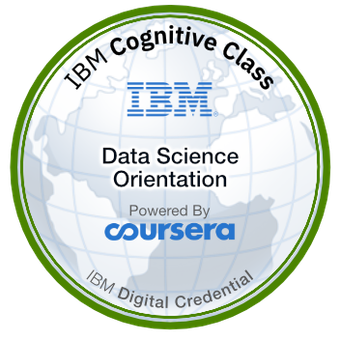

# What is Data Science?

## 📘 Course Description
This course provides an introduction to the field of data science, including its fundamental concepts, various career paths, and essential skills. It explores what data science is and what data scientists do and offers advice for those interested in pursuing a career in this exciting field.

---

## 🧾 Course Syllabus

### Defining Data Science and What Data Scientists Do
- What is Data Science? (Video)
- Fundamentals of Data Science
- The Many Paths to Data Science
- Data Science: The Sexiest Job in the 21st Century
- Advice for New Data Scientists
- What Do Data Scientists Do?
- A Day in the Life of a Data Scientist
- Data Science Skills & Big Data
- Working on Different File Formats
- Data Science Topics and Algorithms
- **Discussion Prompt**: Introduce Yourself
- 📖 *Reading*: What Makes Someone a Data Scientist?

---

### Data Science Topics
- Big Data and Data Mining
- How Big Data is Driving Digital Transformation
- Introduction to Cloud
- Cloud for Data Science
- Foundations of Big Data
- Data Scientists at New York University
- What is Hadoop?
- Big Data Processing Tools: Hadoop, HDFS, Hive, and Spark
- 📖 *Reading*: Data Mining

---

### Deep Learning and Machine Learning
- Artificial Intelligence and Data Science
- Generative AI and Data Science
- Neural Networks and Deep Learning
- Applications of Machine Learning
- 📖 *Reading*: Regression

- 🧪 Lab: Exploring Data using IBM Cloud Gallery

---

### Applications and Careers in Data Science
- Data Science Application Domains
- How Should Companies Get Started in Data Science?
- Old Problems with New Data Science Solutions
- Applications of Data Science
- How Data Science is Saving Lives
- 📖 *Reading*: The Final Deliverable

- Careers in Data Science
- How Can Someone Become a Data Scientist?
- Recruiting for Data Science
- Importance of Mathematics and Statistics for Data Science
- The Report Structure
- 📖 *Reading*: Infograph on roadmap

---

### Optional: Data Literacy for Data Science
- Understanding Data
- Data Sources
- Working on Varied Data Sources and Types
- 📖 *Reading*: Metadata
- Data Literacy
- Data Collection and Organization
- Relational Database Management System
- NoSQL
- Data Marts, Data Lakes, ETL, and Data Pipelines
- Considerations for Choice of Data Repository
- Data Integration Platforms

---

## 📜 Certificate

🔗 [View Verified Certificate](https://www.coursera.org/account/accomplishments/verify/L9P3P2B7CF6G)

---

## 🏅 Digital Badge

🔗 [View Verified Badge](https://www.credly.com/earner/earned/badge/541e5d41-e939-4fae-809c-1595587a32cc)
