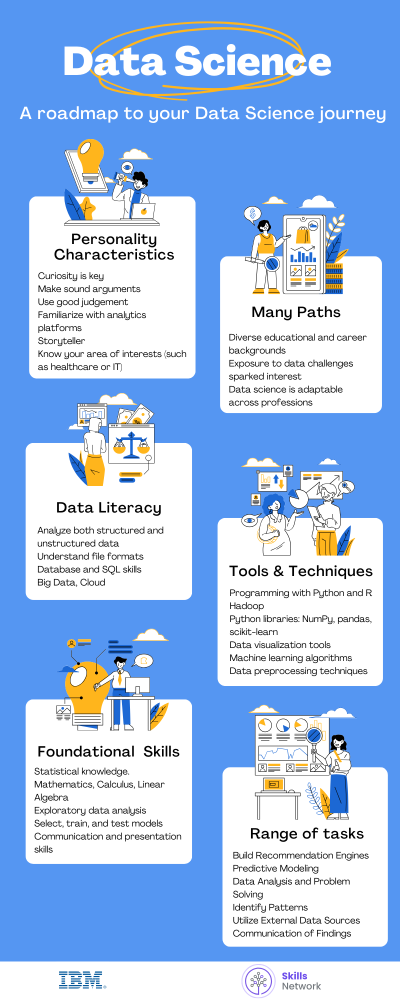

# 📦 Module 3: Data Science in the Real World

This module highlights how data science is applied in real-world business scenarios, with a strong emphasis on career pathways and the practical steps involved in becoming a data scientist.

---

## 📚 Lesson 1: Data Science Application Domains

In this lesson, you learn about the **power of data science applications** and how organizations leverage data to:
- Drive business goals
- Improve operational efficiency
- Make accurate predictions
- Save lives

You’ll explore how data is generated and used, and review the process that data scientists follow to help organizations succeed.

### 🔍 Learning Objectives
- Describe how companies can get started in data science.
- Understand data generation by consumers.
- Explore data science applications in businesses like Netflix, Amazon, UPS, Google, and Apple.
- Describe how data science is applied in healthcare.
- Explain the final deliverable of a data science project and its storytelling aspect.
- Articulate what a data science report should include and how to structure it.
- Demonstrate an understanding of data science roles and responsibilities.

### 🧠 Lesson Content

| Type | Title | Duration |
|------|-------|----------|
| 📖 Reading | How Should Companies Get Started in Data Science? | 3 min |
| 🎥 Video | Old Problems, New Data Science Solutions | 2 min |
| 🎥 Video | Applications of Data Science | 3 min |
| 🎥 Video | How Data Science is Saving Lives | 3 min |
| 🎥 Video | The Final Deliverable | 4 min |
| ✅ Practice Quiz | The Final Deliverable | 4 min |
| 📊 Graded Practice Assignment | Submitted – 100% | |
| 📺 Video | Lesson Summary: Data Science Application Domains | 4 min |
| ✅ Practice Quiz | Data Science Application Domains | |
| 📊 Graded Practice Assignment | Submitted – 100% | |
| 📚 Glossary | Data Science Application Domains | 4 min |
| 🧪 Graded Quiz | Data Science Application Domains | Submitted – 100% |

---

## 👩‍💼 Lesson 2: Careers and Recruiting in Data Science

This lesson explores how to **become a data scientist**, the qualities and skills required, and how to align your abilities with what employers seek. It also highlights how data scientists differ from other data professionals.

### 🔍 Learning Objectives
- Describe the contents of a data science job posting.
- Identify pathways to becoming a data scientist.
- Compare roles of data scientists with other data-related professions.
- Understand the role of mathematics and statistics.
- Learn how to structure the final report of a data science project.

### 🧠 Lesson Content

| Type | Title | Duration |
|------|-------|----------|
| 📖 Reading | How Can Someone Become a Data Scientist? | 3 min |
| 🎥 Video | Recruiting for Data Science | 5 min |
| 🎥 Video | Careers in Data Science | 7 min |
| 🎥 Video | Importance of Mathematics and Statistics for Data Science | 2 min |
| 🎥 Video | The Report Structure | 4 min |
| ✅ Practice Quiz | The Report Structure | 8 min |
| 📊 Graded Practice Assignment | Submitted – 100% | |
| 📺 Video | Lesson Summary: Careers and Recruiting in Data Science | 4 min |
| ✅ Practice Quiz | Careers and Recruiting in Data Science | |
| 📊 Graded Practice Assignment | Submitted – 100% | |
| 📚 Glossary | Careers and Recruiting in Data Science | 3 min |
| 🧪 Graded Quiz | Careers and Recruiting in Data Science | Submitted – 100% |

---

## 📝 Summary and Final Assignment

In the final phase, you will explore job listings and complete a **peer-reviewed project** that involves:
- Reviewing a real job posting
- Matching job expectations with course content
- Walking through a case study of Sarah’s data science journey

### 🧠 Content and Activities

| Type | Title | Duration |
|------|-------|----------|
| 📖 Reading | A Roadmap to your Data Science Journey | 4 min |
| 📖 Reading | Case Study: Final Assignment | 3 min |
| 🧪 Graded Quiz | Based on Case Study | Submitted – 100% |
| 🔍 Explore | Data Science Job Listings | 1 min |
| 🧪 Final Exam | Submitted – 100% |

📌 **Final Assignment**  
Match a real-world job posting to skills learned in this course and reflect on your journey and career aspirations as a data scientist.

## 🗺️ A Roadmap to Your Data Science Journey

This visual guide outlines the steps and skills needed to pursue a successful career in data science...

---

### ✅ Key Takeaways
- Data science impacts every industry.
- Companies look for adaptable, curious, and technically skilled data scientists.
- You now understand how to evaluate job listings and communicate your qualifications.
- You’ve developed foundational knowledge that can guide your future learning and career in data science.

---

