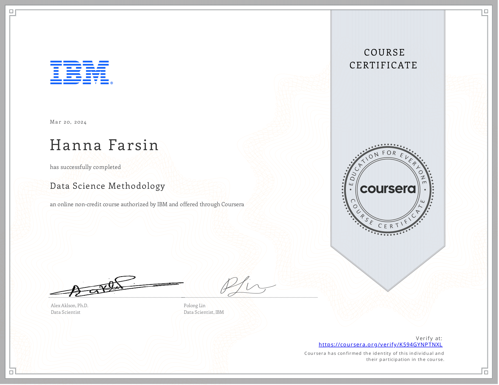
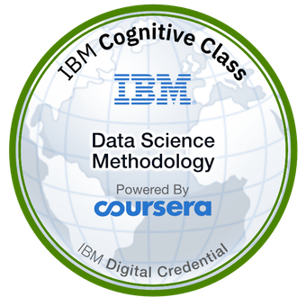

# 🧠 IBM Data Science Professional Certificate  
## Course 3: Data Science Methodology
---

## 📝 Course Description
This course introduces the **methodology followed by data scientists** to tackle problems and deliver data-driven solutions. You will learn about each step in the data science methodology — from understanding the problem to collecting, preparing, modeling, evaluating, and finally deploying the solution.

---

## 📚 Modules Breakdown

### ✅ Module 1: From Problem to Approach & From Requirements to Collection
- Understanding the business problem and analytic approach
- Gathering data requirements and collection strategies
- 🧪 **Hands-on Labs**: Problem framing, data collection
- 📖 Readings, quizzes, and summaries

---

### ✅ Module 2: From Understanding to Preparation & From Modeling to Evaluation
- Understanding and preparing data for modeling
- Building and evaluating predictive models
- 🧪 **Hands-on Labs**: Data prep and modeling
- 📖 Readings, quizzes, and case studies

---

### ✅ Module 3: From Deployment to Feedback
- Deploying the model in real-world scenarios
- Gathering feedback and refining solutions
- Importance of storytelling in Data Science
- 📖 Summary, quizzes, and wrap-up videos

---

### ✅ Module 4: Final Project and Assessment
- 📌 **Final Project**: Apply CRISP-DM methodology end-to-end
- 📜 **Peer-reviewed assignment**
- 🎓 **Graded Final Exam**
- 🏆 **Grade Achieved**: 91%

---

## 📌 Highlights

- Learned and applied **CRISP-DM methodology**
- Completed a **real-world data science project**
- Shared work publicly via **GitHub** and **Jupyter Notebooks**

---

## 📜 Certificate

🔗 [View Verified Certificate](https://www.coursera.org/account/accomplishments/verify/K594GYNPTNXL)

---

## 🏅 Digital Badge

🔗 [View Verified Badge](https://www.credly.com/earner/earned/badge/f219d9c3-7a3e-4278-900b-ade6ea7cea6f)

---
