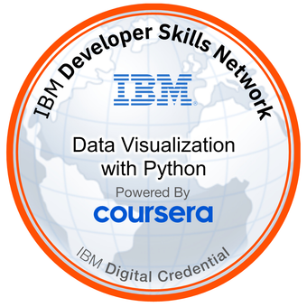

#  Data Visualization with Python (IBM)

**Course Objective**  
This course helps learners master the art of presenting data using rich visualizations. You’ll explore multiple tools and libraries in Python to tell meaningful stories through compelling charts, graphs, and interactive dashboards.

---

## 🧠 What You'll Learn

- Create plots with **Matplotlib**, **Seaborn**, **Folium**, and **Plotly**
- Build **basic and advanced charts**: line, area, bar, pie, histograms, waffle charts, word clouds, choropleth maps, etc.
- Visualize **geospatial data** using Folium
- Develop **interactive dashboards** using Plotly and Dash
- Apply best practices in choosing the right chart for the data

---

## 🗂️ Modules Overview

### 📘 Module 1: Introduction to Data Visualization Tools
- Importance of data visualization
- History and architecture of Matplotlib
- Introduction to basic plotting with Matplotlib
- Explore and analyze the Canadian immigration dataset
- 📌 **Hands-on Labs**: Pandas & Line Plots  
- ✅ Graded Quiz

---

### 📘 Module 2: Basic and Specialized Visualization Tools
- Create: Area Plots, Histograms, Bar Charts, Pie Charts, Box Plots, Scatter Plots
- Plotting directly with Matplotlib
- 📌 **Hands-on Labs**: All chart types  
- ✅ Graded Quiz

---

### 📘 Module 3: Advanced Visualizations & Geospatial Data
- Advanced charts: Waffle Charts, Word Clouds
- Visualizing relationships with **Seaborn Regression Plots**
- Geospatial visualization with **Folium**
  - Maps with markers
  - Choropleth maps
- 📌 **Hands-on Labs**: Word clouds, regression plots, geospatial maps  
- ✅ Graded Quiz

---

### 📘 Module 4: Creating Dashboards with Plotly and Dash
- Introduction to dashboarding tools
- Creating charts with **Plotly Graph Objects** and **Plotly Express**
- Building interactive dashboards using **Dash** (HTML + Core Components)
- Add interactivity with callbacks
- 📌 **Hands-on Labs**: Create a real dashboard  
- ✅ Graded Quiz

---

### 📘 Module 5: Final Project & Exam
- **Practice Project**: Analyze wildfire data + create dashboards  
- **Final Project**:
  1. Create visualizations (Matplotlib, Seaborn, Folium)
  2. Build interactive dashboards (Plotly + Dash)
  3. Peer review assignments
- ✅ **Final Exam**: Timed quiz
- 🎓 **Badge Earned**: IBM – Data Visualization with Python

---

## 🛠️ Tools & Libraries Used

- `Matplotlib`
- `Seaborn`
- `Folium`
- `Plotly`
- `Dash`
- `Pandas`, `Jupyter Notebook`, `Cloud IDE`

---
## 📜 Certificate

🔗 [View Verified Certificate](https://www.coursera.org/account/accomplishments/verify/2VHZC3ZLGKPT)

---

## 🏅 Digital Badge

🔗 [View Verified Badge](https://www.credly.com/earner/earned/badge/d920feea-6563-4993-866d-959707e90020)

---
