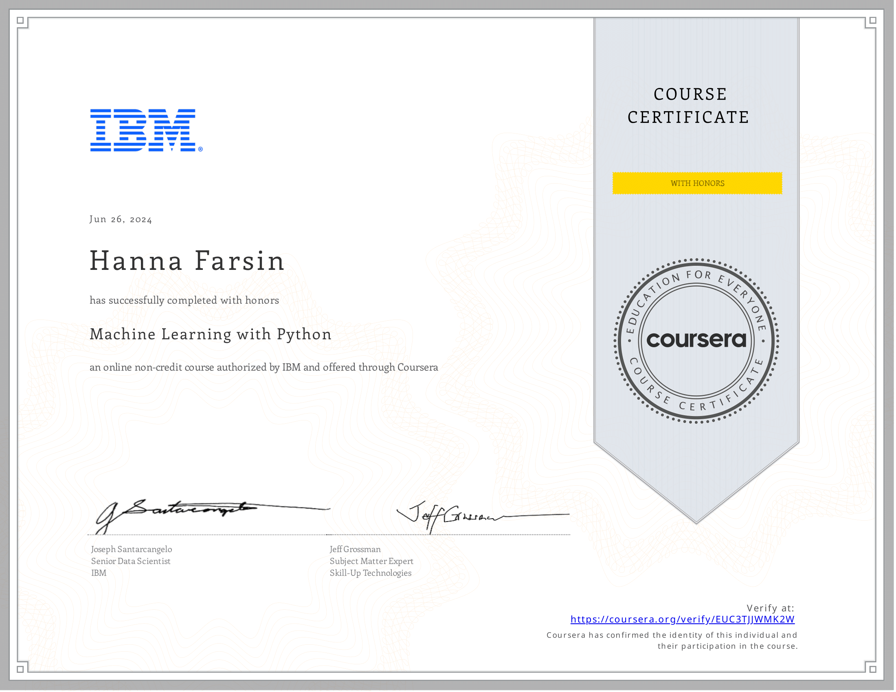
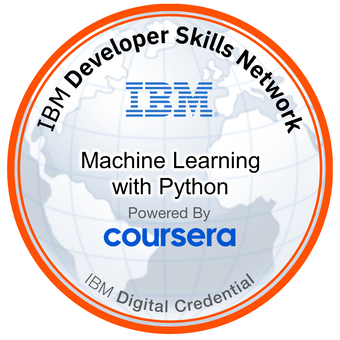

# 🤖 IBM Data Science Professional Certificate – Course 4: Machine Learning with Python

## 📘 About this Course
This course introduces the foundational concepts of **machine learning (ML)** using **Python**—the most in-demand language for ML jobs. You will gain practical experience building models with **Scikit-learn**, working in **Jupyter Notebooks**, and applying statistical methods such as **regression**, **classification**, and **clustering**.

Throughout the course, you’ll:
- Understand the iterative nature of ML model development
- Explore **supervised** and **unsupervised** learning techniques
- Learn about model evaluation, bias-variance tradeoff, and tuning

By the end, you’ll be able to apply essential ML techniques and showcase your skills in a **peer-reviewed project** and **final exam**.

---

## 📂 Course Modules

### 📌 Module 1: Introduction to Machine Learning
- Applications in healthcare, banking, telecom, etc.
- Supervised vs. Unsupervised Learning
- ML pipeline overview
- Python libraries used in ML (e.g., Scikit-learn)

🎯 **Graded Assessment:** Intro to Machine Learning Quiz

---

### 📌 Module 2: Regression
- Simple vs. Multiple Regression
- Linear vs. Non-linear Regression
- Model evaluation (R², MSE)
- Regression in real datasets (hands-on labs)

📚 **Includes:** 5 Videos, 3 Readings  
🎯 **Graded Assessment:** Regression Quiz

---

### 📌 Module 3: Classification
- Classification algorithms:
  - Logistic Regression
  - K-Nearest Neighbors (KNN)
  - Decision Trees
  - Support Vector Machines (SVM)
- Accuracy metrics (Precision, Recall, F1-score)

📚 **Includes:** 5 Videos, 1 Reading  
🎯 **Graded Assessment:** Classification Quiz

---

### 📌 Module 4: Linear Classification
- Introduction to linear classifiers
- Concepts behind decision boundaries
- Hands-on lab using Scikit-learn

📚 **Includes:** 4 Videos, 1 Reading  
🎯 **Graded Assessment:** Linear Classification Quiz

---

### 📌 Module 5: Clustering
- K-Means Clustering
- Distance metrics and cluster centroids
- Customer segmentation use case

📚 **Includes:** 3 Videos  
🎯 **Graded Assessment:** Clustering Quiz

---

### 📌 Module 6: Final Exam and Capstone Project
- 💻 Final Project: Apply ML techniques to a real-world dataset
- 📄 Submit your project for peer evaluation
- 🎯 **Graded:** Final Exam and Peer Review

---

## 📁 Folder Structure Suggestion

```plaintext
Machine-Learning-with-Python/
│
├── Module1_Introduction/
│   └── notes.md
├── Module2_Regression/
│   └── regression_labs.ipynb
├── Module3_Classification/
│   └── classification_models.ipynb
├── Module4_Linear_Classification/
│   └── decision_boundaries.ipynb
├── Module5_Clustering/
│   └── kmeans_customer_segmentation.ipynb
├── Module6_Final_Project/
│   ├── project_report.ipynb
│   └── README.md
└── README.md

---
## 📜 Certificate



🔗 [View Verified Certificate](https://www.coursera.org/account/accomplishments/verify/EUC3TJJWMK2W)

---

## 🏅 Digital Badge



🔗 [View Verified Badge](https://www.credly.com/earner/earned/badge/ddbe8883-fbbe-4834-8f04-e2400065510c)


---

