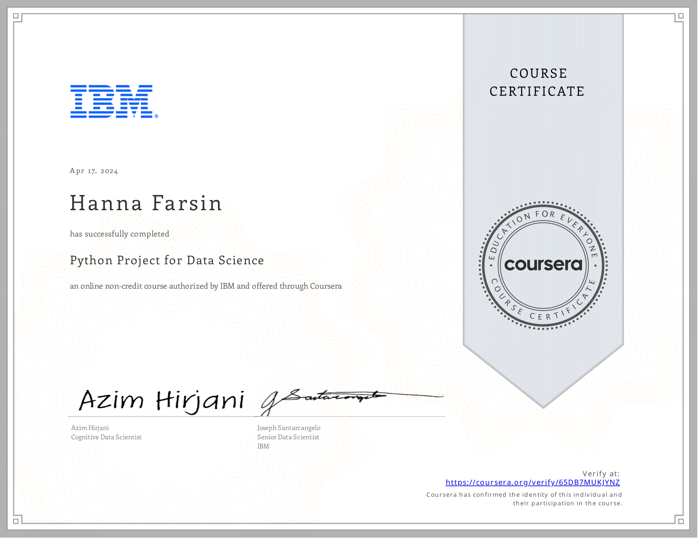
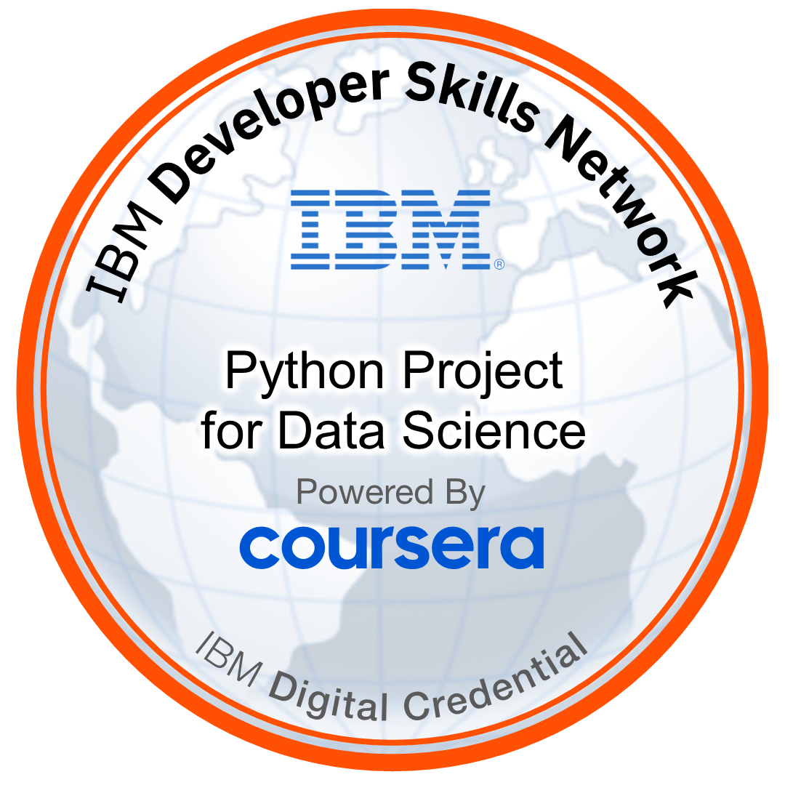

# 🧪 Python Project for Data Science  
**Offered by IBM via Coursera**

---

## 📘 About this Course

This mini-course is designed for learners to **demonstrate foundational Python skills** in a real-world data project. You will take on the role of a **Data Scientist or Data Analyst**, working with real-world data to identify patterns and trends.

Through this hands-on project, you will:

- Extract and manipulate data
- Perform **web scraping**
- Conduct data visualization
- Build a **dashboard** using Python in a **Jupyter Notebook**

This project showcases your skills with Python libraries such as **Pandas** and **BeautifulSoup**, and can be a great addition to your **job portfolio**.

> **📝 Pre-requisite:**  
Before taking this course, you should have completed the **Python for Data Science, AI and Development** course by IBM or possess equivalent Python proficiency.

> **⚠️ Note:**  
This course focuses on application, not instruction. It assumes prior Python knowledge.

---

## 🗂️ Syllabus Overview

### 📦 Module 1: Crowdsourcing Short Squeeze Dashboard

In this module, you will:

- Apply Python fundamentals and data structures
- Perform data extraction and manipulation
- Conduct web scraping
- Visualize historical data
- Build an interactive dashboard

You’ll complete tasks using **Python**, **Pandas**, **BeautifulSoup**, and **Matplotlib/Plotly**, all within a **Jupyter Notebook**.

---

## ✅ Graded Components

| Task                                                                 | Type      |
|----------------------------------------------------------------------|-----------|
| Extracting Stock Data Using a Python Library                         | ✅ Graded |
| Extracting Stock Data Using Web Scraping                             | ✅ Graded |
| Analyzing Historical Stock/Revenue Data and Building a Dashboard     | ✅ Graded (Peer-Reviewed) |

---

## 📜 Certificate

🔗 [View Verified Certificate](https://www.coursera.org/account/accomplishments/verify/65DB7MUKJYNZ)

---

## 🏅 Digital Badge

🔗 [View Verified Badge](https://www.credly.com/earner/earned/badge/d75a5911-2144-4551-882f-ceec6ddcc1f4)

---

## 🧰 Tools & Libraries Used

- Python
- Jupyter Notebook
- Pandas
- BeautifulSoup
- yfinance
- Matplotlib / Plotly

---

