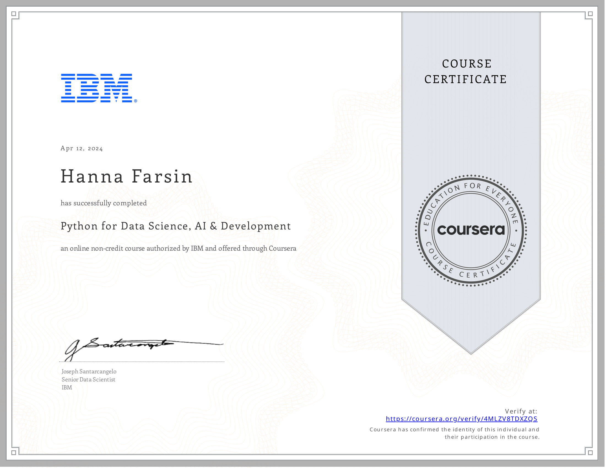
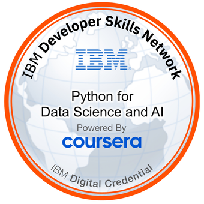

# 📘 Python for Data Science, AI & Development  
*Course 4 of 10 in the IBM Data Science Professional Certificate*

---

## 📖 About this Course

Kickstart your learning of Python with this beginner-friendly self-paced course taught by an expert. Python is one of the most popular languages in the programming and data science world, and demand for individuals who have the ability to apply Python has never been higher.

This introduction to Python course will take you from zero to programming in Python in a matter of hours—no prior programming experience necessary!

You will:
- Learn Python basics and different data types.
- Understand Python data structures like Lists, Tuples, Dictionaries, and Sets.
- Explore logic concepts like conditions, loops, and functions.
- Use libraries such as **Pandas**, **NumPy**, and **BeautifulSoup**.
- Perform data collection and web scraping with APIs.
- Gain hands-on experience using **Jupyter Notebooks**.

By the end of this course, you’ll feel comfortable creating basic programs, working with data, and automating real-world tasks using Python.

---

## 🧠 Course Details

- **Level:** Beginner  
- **Duration:** 5 weeks (3–6 hours/week)  
- **Language:** English  
  - Subtitles: Arabic, French, Bengali, Ukrainian, Chinese (Simplified), Greek, Italian, Portuguese (Brazil), Vietnamese, Dutch, Korean, Oriya, German, Pashto, Urdu, Russian, Thai, Indonesian, Swedish, Turkish, Azerbaijani, Spanish, Dari, Hindi, Japanese, Kazakh, Hungarian, Polish  
- **How to Pass:** Pass all graded assignments  
- **Average User Rating:** ⭐ 4.6  

---

## 🗂️ Syllabus Overview

### 📦 Module 1: Python Basics
- Introduction to data types (integers, floats, strings)
- Using expressions and storing values in variables
- Manipulating strings  
**📌 Assessment:** Module 1 Graded Quiz

---

### 📦 Module 2: Python Data Structures
- Lists and Tuples
- Dictionaries and key-value data
- Sets and unique collections  
**📌 Assessment:** Module 2 Graded Quiz

---

### 📦 Module 3: Python Programming Fundamentals
- Conditions and branching
- Loops and iterations
- Functions and exception handling
- Intro to classes and objects  
**📌 Assessment:** Module 3 Graded Quiz

---

### 📦 Module 4: Working with Data in Python
- Reading and writing files
- Introduction to Pandas and NumPy  
**📌 Assessment:** Module 4 Graded Quiz

---

### 📦 Module 5: APIs and Data Collection
- Using APIs and web scraping with BeautifulSoup
- Reading from various file formats  
**📌 Assessments:** Module 5 Graded Quiz, Final Exam

---
## 📜 Certificate

🔗 [View Verified Certificate](https://www.coursera.org/account/accomplishments/verify/4MLZV8TDXZQS)

---

## 🏅 Digital Badge

🔗 [View Verified Badge](https://www.credly.com/earner/earned/badge/fc4cfdb7-f0f3-4b23-8f96-7116668fa055)

---

## 🏁 Completion

To complete this course, learners must pass all graded quizzes and the final exam. A certificate and badge are awarded upon successful completion.

---

> 💡 *This course is ideal for aspiring Data Scientists, Data Analysts, Developers, and AI/ML Engineers.*

