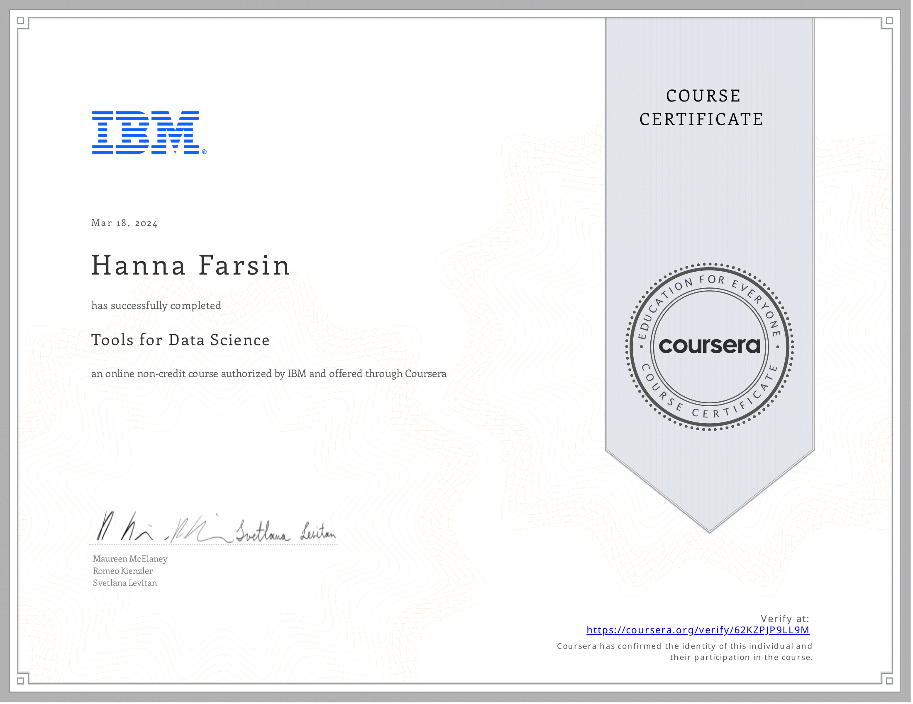
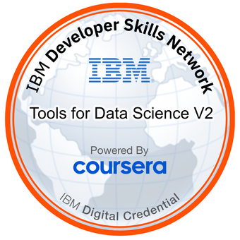

# 🧰 Tools for Data Science by IBM

## 📘 About this Course

In order to be successful in Data Science, you need to be skilled with using tools that Data Science professionals employ as part of their jobs. This course teaches you about the popular tools in Data Science and how to use them.

You will become familiar with the Data Scientist’s tool kit which includes: Libraries & Packages, Data Sets, Machine Learning Models, Kernels, as well as the various Open source, Commercial, Big Data and Cloud-based tools.

Work with **Jupyter Notebooks**, **JupyterLab**, **RStudio IDE**, **Git**, **GitHub**, and **Watson Studio**. You will understand what each tool is used for, what programming languages they can execute, their features, and limitations.

This course gives plenty of hands-on experience in order to develop skills for working with these Data Science Tools. With the tools hosted in the cloud on Skills Network Labs, you will be able to test each tool and follow instructions to run simple code in Python, R, or Scala.

---

## 🎯 Learning Goals for the Course

In this course, you will be introduced to a Data Scientist's workbench or toolkit that consists of a variety of tools, languages, libraries, APIs, data sets, models, etc. used by Data Scientists.

You don’t need to memorize every tool mentioned. Instead, you’ll gain a clear understanding of categories and examples of tools, getting hands-on experience with a few key ones. As you progress through the specialization, you’ll revisit and use more tools and libraries in depth.

✅ You need to complete the **first 6 out of 7** modules to successfully finish the course. Module 7 is optional.

---

## 📚 Course Syllabus

### **Module 1: Overview of Data Science Tools**

- Learn about the different types and categories of tools that data scientists use.
- Understand Open Source, Commercial, and Cloud-based tools.

**Objectives**:
- Describe the components of a data scientist’s toolkit
- List various tool categories and examples

---

### **Module 2: Languages of Data Science**

- Understand which programming language to learn and why.
- Explore Python, R, SQL, and other common languages.

**Objectives**:
- Identify roles and language selection criteria
- Understand Python, R, SQL, Java, Scala, Julia, and their uses

---

### **Module 3: Packages, APIs, Data Sets and Models**

- Dive deep into libraries, APIs, datasets, and machine learning models.

**Objectives**:
- List scientific, visualization, ML, and DL libraries
- Explain REST APIs and data sources
- Use models to solve problems and explore ML models on the Model Asset eXchange

---

### **Module 4: Jupyter Notebooks and JupyterLab**

- Learn to use Jupyter and JupyterLab in cloud and local environments.

**Objectives**:
- Understand Jupyter architecture and kernels
- Use tools in Anaconda Jupyter environment
- Explore cloud-based notebook environments

---

### **Module 5: RStudio and GitHub**

- Start with R and visualization using `plot()`.
- Learn Git and GitHub fundamentals.

**Objectives**:
- Use RStudio and R capabilities
- Understand version control and GitHub usage
- Create repositories, upload files, use branches, and perform merges

---

### **Module 6: Final Project and Assessment**

- Work on a Jupyter Notebook project to apply what you’ve learned.

**Objectives**:
- Create and share notebooks using Markdown and code
- Evaluate peer notebooks
- Demonstrate knowledge of languages, libraries, and tools

---

### **Module 7: IBM Watson Studio (Optional)**

- Learn about IBM Watson Studio and IBM Cloud for Data Science tasks.

**Objectives**:
- Create a Watson Studio project and notebook
- Use templates and kernels in Watson Studio
- Connect and publish notebooks to GitHub

---

> ⚠️ **Note**: Module 7 is optional but recommended for learners interested in IBM’s cloud platform.

---

## 📜 Certificate

🔗 [View Verified Certificate](https://www.coursera.org/account/accomplishments/verify/62KZPJP9LL9M)

---

## 🏅 Digital Badge

🔗 [View Verified Badge](https://www.credly.com/earner/earned/badge/09e29505-3d56-4946-9b2b-8a6b73b01fd8)

